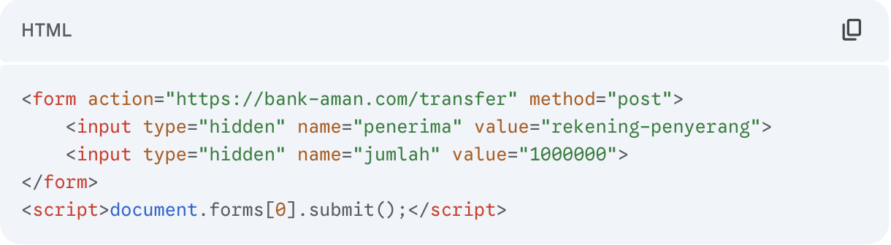
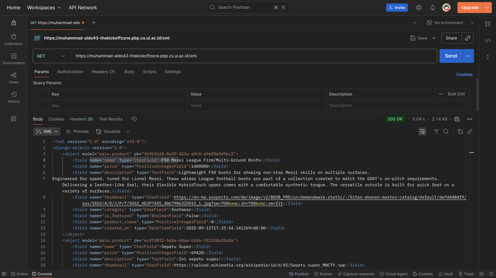
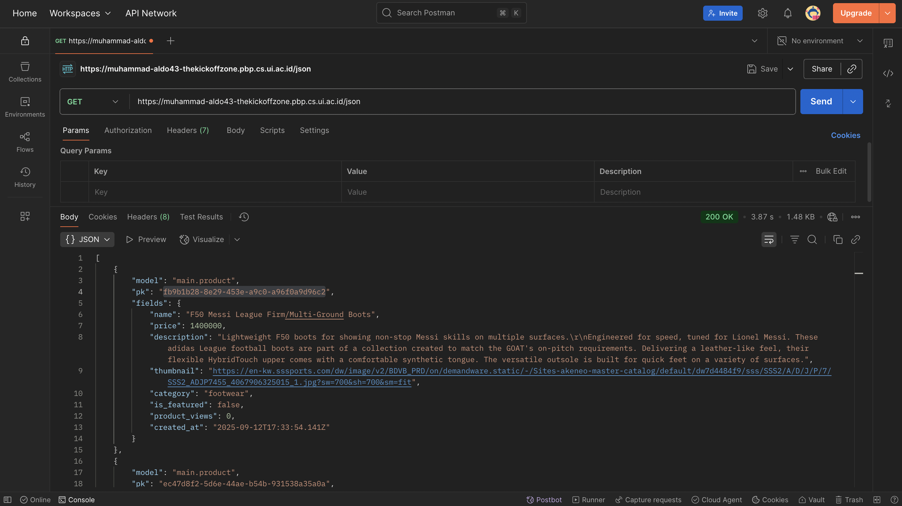
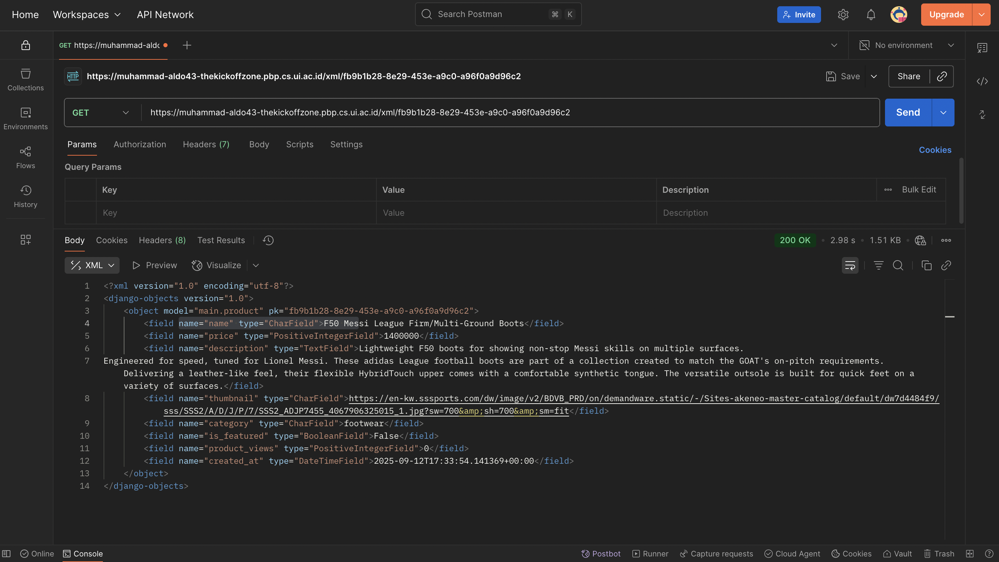
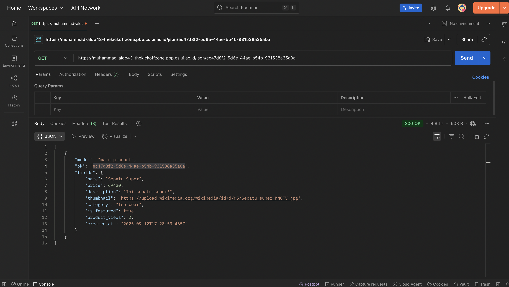

<H1>TUGAS INDIVIDU 2</H1>

<H2>1. Jelaskan bagaimana cara kamu mengimplementasikan checklist di atas secara step-by-step (bukan hanya sekadar mengikuti tutorial).</H2>

Pertama-tama, saya membuat repository baru pada github saya dan melakukan cloning repository. Lalu, saya membuat python environment baru dan menginstall beberapa dependencies yang dibutuhkan dengan menuliskannya pada berkas requirements.txt terlebih dahulu. Isi dari berkas tersebut sementara diisikan kebutuhan dasar pengembangan sesuai dengan yang telah disediakan pada tutorial. Hal ini tidak menutup kemungkinan untuk menginstall dependencies lainnya apabila dibutuhkan. Jika itu terjadi, saya bisa menjalankan command pip/pip3 install pada terminal saya dan melakukan freeze ke berkas requirements.txt untuk mengupdate list dari dependencies yang dibutuhkan.

Setelah menginstall dependencies, sekarang saya sudah bisa menjalankan command Django. Saya kemudian mengisiasikan sebuah project Django baru pada direktori repository saya dengan nama the_kickoff_zone yang direncanakan menjadi nama dari football shop saya. Setelah itu, saya melanjutkan dengan preparasi deployment ke PWS. Hal ini dilakukan dengan menambahkan environment variables pada berkas .env dan .env.prod dan melakukan konfigurasi pada settings.py dengan fungsi load_dotevnt(). Saya pun tidak lupa untuk menambahkan berkas .gitignore agar repository saya tidak melacak berkas-berkas sensitif seperti environment variables. Saya melanjutkan dengan memasukkan environment variables ke dalam PWS, menambahkan repository PWS sebagai remote repository dan melakukan deployment pada PWS sembari mengecek apakah instalasi dan inisiasi project berhasil. Tidak lupa, saya menambahkan url local dan online dari project ke dalam ALLOWED_HOST untuk membuka restriksi akses terhadap project, melakukan konfigurasi variabel PRODUCTION dan DEBUG, serta melakukan konfigurasi Database.

Setelah melakukan makemigrations dan migrate, project berhasil dideploy ke internet. Sekarang, saya melanjutkan pengembangan dengan menginisiasikan aplikasi baru dengan nama main. Kemudian, saya membuat model data baru di berkas models.py di aplikasi main dengan nama Product yang memiliki 6 atribut wajib yang dibutuhkan. Tentu model hal ini masih bisa berubah kedepannya. Apabila di lain waktu saya ingin memodifikasi model Product atau menambahkan model lainnya, saya bisa dengan mudah melakukannya dengan memodifikasi berkas models.py dan melakukan makemigrations dan migrate. 

Saya melanjutkan pengembangan dengan membuat fungsi show_main() untuk menampilkan template aplikasi main tersebut di berkas views.py dan memasukkan beberapa context untuk kemudian ditampilkan oleh template. Dengan adanya fungsi show_main(), saya bisa melakukan routing. Saya melakukan routing dengan membuat berkas urls.py di direktori aplikasi main dan mengimport fungsi show_main() dari views.py. Selanjutnya saya pasangkan fungsi show_main() tersebut dengan url pattern dengan path '' (empty string) sehingga fungsi tersebut akan dapat ditampilkan sebagai landing page tanpa memerlukan endpoint tertentu. Agar dapat berfungsi dengan benar, saya mengimport semua url dari aplikasi main ke project Django saya dengan memanfaatkan fungsi include pada berkas urls.py milik project Django saya. 

Dengan adanya model, view, dan routing, saya hanya perlu membuat template agar dapat menampilkan view kepada pengguna. Saya melanjutkan dengan membuat folder templates di direktori aplikasi main dan membuat berkas main.html. Berkas template tersebut saya isi dengan tampilan sederhana menggunakan tag header dan paragraph untuk menampilkan data yang telah diproses oleh view. Dengan demikian, selesai sudah pengembangan yang perlu dilakukan untuk tugas individu 2 ini. 

Saya juga menambahkan beberapa test dasar pada aplikasi main saya sebagai bentuk kedisiplinan saya sebagai pengembang. Kelak di tugas-tugas selanjutnya, project Django saya bisa jadi akan sangat besar sehingga menjadikan pengetesan secara manual menjadi ineffective dan time-consuming. Namun demikian, untuk sementara, test yang saya masukkan masih sangat sederhana. Tentunya hal ini akan terus berubah seiring berjalannya waktu.

Terakhir, saya melakukan git add, commit, dan push ke kedua remote repository saya (origin dan PWS). PWS kemudian akan menge-build project saya dan, voila, project saya berhasil dideploy ke internet

<H2>2. Buatlah bagan yang berisi request client ke web aplikasi berbasis Django beserta responnya dan jelaskan pada bagan tersebut kaitan antara urls.py, views.py, models.py, dan berkas html.</H2>

Referensi: Slides perkuliahan PBP Semester Gasal 2025/2026

<H2>3. Jelaskan peran settings.py dalam proyek Django!</H2>

Sesuai dengan namanya, berkas settings.py merupakan pusat konfigurasi utama untuk proyek Django yang kita miliki. Kita dapat menyeting project Django kita melalui berkas ini. Konfigurasi yang terdapat di berkas settings.py diantaranya adalah: INSTALLED_APPS, MIDDLEWARE, ALLOWED_HOSTS, Database, dan lain-lain. Berkas tersebut memastikan bahwa project Django kita berjalan dengan baik dan benar. 

Referensi: https://docs.djangoproject.com/en/5.2/topics/settings/

<H2>4. Bagaimana cara kerja migrasi database di Django?</H2>

Migrasi database di Django dilakukan dalam 2 tahap, yaitu: makemigrations dan migrate. 

Command makemigrations akan membandingkan kondisi model saat ini (setelah perubahan) dengan kondisi terakhir yang tercatat dalam file migrasi sebelumnya. Kemudian, Django akan secara otomatis membuat file python baru di dalam direktori migrations/ berdasarkan perbedaan tersebut. File yang dibuat sendiri berisikan isntruksi spesifik tentang cara menerapkan perubahan tersebut ke database. Hal ini meliputi, tetapi tidak terbatas pada: AddField, CreateTable, dan lain-lain. Secara singkat makemigrations berfungsi untuk mempersiapkan migrasi skema model ke dalam database Django lokal.

Selanjutnya command migrate akan menerjemahkan berkas-berkas migrasi yang telah dibuat sebelumnya (untuk migrasi-migrasi yang belum terimplementasi) menjadi syntax SQL atau bahasa lainnya sesuai dengan tipe database yang digunakan. Singkatnya, command ini dijalankan untuk menerapkan skema model yang telah dibuat ke dalam database Django lokal.

<H2>5. Menurut Anda, dari semua framework yang ada, mengapa framework Django dijadikan permulaan pembelajaran pengembangan perangkat lunak?</H2>

Sebelumnya, mahasiswa di Fasilkom UI sudah mengenal bahasa pemrograman Python pada masa mengambil mata kuliah Dasar-dasar Pemrograman 1. Hal ini menjadikan Django yang menggunakan bahasa pemrograman Python menjadi pilihan yang ideal untuk dijadikan permulaan pembelajaran pengembangan perangkat lunak. Selain dari itu, struktur dari aplikasi Django bersifat modular dan cenderung mudah dipahami (walaupun opini ini tentu relatif). Modularitas tersebut juga memungkinkan project-project Django bersifat lebih scalable sehingga nyaman untuk digunakan. Bahkan, aplikasi-aplikasi besar seperti Instagram, Spotify, dan Pinterest juga ternyata menggunakan Django. Hal ini membuktikan bahwa Django adalah framework yang cukup powerful. Bekal ini tentunya akan sangat berguna di dunia pekerjaan. Demikian pendapat saya.

<H2>6. Apakah ada feedback untuk asisten dosen tutorial 1 yang telah kamu kerjakan sebelumnya?</H2>

Sangat baik, Kak! Tutorial yang diberikan komprehensif dan mudah dipahami. Selain dari praktik, tutorial juga memberikan bacaan teori yang bisa kami (mahasiswa) manfaatkan untuk meningkatkan pemahaman terkait PBP. Terima kasih atas kerja kerasnya! Saya do'akan kakak-kakak senantiasa sehat dan bahagia.

 
<H1>TUGAS INDIVIDU 3</H1>

<H2>1.  Jelaskan mengapa kita memerlukan data delivery dalam pengimplementasian sebuah platform?</H2>

Data delivery dibutuhkan oleh sebuah platform untuk menampilkan data dari backend ke frontend. Tentunya, data merupakan salah satu unsur yang sangat penting bagi sebuah platform sebagai sebuah teknologi informasi. Mengimplementasikan mekanisme data delivery yang baik bisa dilihat seperti membangun sebuah sistem peredaran darah bagi platform. Sistem inilah yang memastikan bahwa  yang tepat sampai ke tempat yang tepat pada waktu yang tepat sehingga seluruh ekosistem digital platform berfungsi sebagai satu kesatuan yang koheren. Dengan mekasnisme data delivery yang baik, kita juga mampu memisahkan cara data dikirim dan cara data diproses sehingga kita, sebagai pengembang, dapat mengembangkan dan menskalakan frontend dan backend secara independen.

<H2>2. Menurutmu, mana yang lebih baik antara XML dan JSON? Mengapa JSON lebih populer dibandingkan XML?</H2>

Saya setuju bahwasanya JSON cenderung lebih populer dibandingkan XML. Pun saya lebih senang menggunakan format JSON ketimbang XML. Alasannya bermacam-macam, mulai dari penggunaan metode key-value (JSON) yang terasa lebih intuitif dibandingkan dengan opening-closing-tag (XML), kompatibilitas parsing (dimana JSON dapat di parse secara native dengan JSON.parse()), dan dukungan JSON untuk menggunakan beberapa tipe data dasar. Kelebihan-kelebihan tersebut membuat JSON lebih populer untuk digunakan. Kendati demikian, pada kasus-kasus tertentu, format XML mungkin akan lebih cocok untuk digunakan daripada JSON. Jadi, sejatinya, tidak ada yang lebih baik diantara keduanya. Format-format tersebut baik digunakan pada kasus yang sesuai masing-masing.

Sumber: Crockford, D. (2006). The JSON Data Interchange Format. RFC 4627, W3C. (2008). Extensible Markup Language (XML) 1.0 (Fifth Edition).

<H2>3. Jelaskan fungsi dari method is_valid() pada form Django dan mengapa kita membutuhkan method tersebut!</H2>

Fungsi is_valid() menjalankan validasi data yang dikirimkan oleh pengguna terhadap aturan-aturan yang telah didefinisikan dalam kelas form yang di refer. Beberapa validasi yang dilakukan adalah: Pemeriksaan kesesuaian tipe data antara input user dan field pada form, pemeriksaan batasan (seperti: required, max_length, dll.), dan menjalankan method-method validasi custom bila ada. 

Kita membutuhkan method tersebut untuk menjaga keamanan dan integritas data karena data pada form akan diteruskan ke database yang kita miliki. Dengan mengimplementasikan fungsi is_valid() kita  memastikan semua data yang dikirim form sudah disanitasi dan bersih. Kita jadi juga bisa mengakses data bersih tersebut melalui dictionary cleaned_data yang digenerate otomatis oleh Django. 

<H2>4. Mengapa kita membutuhkan csrf_token saat membuat form di Django? Apa yang dapat terjadi jika kita tidak menambahkan csrf_token pada form Django? Bagaimana hal tersebut dapat dimanfaatkan oleh penyerang?</H2>

Cross-Site Request Forgery (CSRF) merupakan serangan siber yang terjadi ketika situs web jahat menipu pengguna yang sedang login di situs web lain untuk tanpa sadar mengirimkan request berbahaya ke situs jahat tersebut.

Salah satu manipulasi tersebut dapat adalah sebagai berikut:

Form tersebut mungkin tersedia di sebuah-situs-jahat.com, dimana situs tersebut memiliki tampilan yang identik dengan bank-aman.com sehingga user mengira bahwa ia sedang berada di bank-aman.com. Selanjutnya, boleh jadi bahwa user masih login di bank-aman.com sehingga browser akan secara otomatis menyertakan cookie sesi user dalam request tersebut. Ketika server bank-aman.com melihat permintaan POST yang valid beserta cookie yang valid, server akan mengasumsikan request tersebut valid dan berasal dari user (bukan penyerang) dan memproses transfer uang dan akhirnya user akan kehilangan uang.

Untuk mengatasi serangan tersebut, Django menggunakan , yaitu template tag yang wajib disertakan dalam setiap form di Django yang menggunakan metode POST. Token ini adalah mekanisme pertahanan utama Django melawan serangan siber yang disebut Cross-Site Request Forgery (CSRF). Saat Django me-render halaman yang berisi form dengan , ia menghasilkan sebuah token rahasia yang unik untuk sesi pengguna tersebut dan menyisipkannya sebagai input tersembunyi (hidden input) di dalam form. Ketika form tersebut di-submit, browser akan mengirimkan kembali csrfmiddlewaretoken ini bersama data form lainnya. Middleware CSRF di sisi server Django akan memeriksa apakah nilai token yang dikirim ini cocok dengan token yang seharusnya dimiliki oleh sesi pengguna tersebut. Jika csrf_token tidak ada atau tidak cocok, Django akan menolak permintaan tersebut dengan error 403 Forbidden, sehingga transaksi berbahaya seperti transfer uang di atas akan gagal. Dengan demikian, kita terhindar dari transaksi-transaksi yang berbahaya dan merugikan sebab kita memiliki mekanisme untuk validasi menggunakan csrf_token.

Sumber: 
- https://docs.djangoproject.com/en/stable/howto/csrf/
- https://cheatsheetseries.owasp.org/cheatsheets/Cross-Site_Request_Forgery_Prevention_Cheat_Sheet.html

<H2>5. Jelaskan bagaimana cara kamu mengimplementasikan checklist di atas secara step-by-step (bukan hanya sekadar mengikuti tutorial).</H2>

Tugas 3 ini masih terbilang cukup singkat. 
- Saya memulai dengan mengimplementasikan template base.html dan menambahkan path nya ke settings.py
- Kemudian, saya memodifikasi file main.html untuk mengimplementasikan template base.html tersebut.
- Karena model Product saya belum memiliki atribut id, saya melanjutkan dengan memodifikasi model saya agar memiliki kolom UUID yang digenerate secara otomatis secara default, melakukan makemigrations, dan migrate. 
- Sealnjutnya, saya membuat fungsi-fungsi baru pada views.py (create_product, show_product, show_xml, show_json, show_xml_by_id, show_json_by_id) dan melakukan routing pada urls.py di aplikasi main. 
- Saat mendefinisikan fungsi-fungsi pada views.py, saya mereturn renderan beberapa template html yang belum saya buat sehingga saya melanjutkan development dengan membuat template create_product.html dan product_details.html
- create_product.html berisi sebuah form yang akan melakukan request POST dan menambahkan produk ke database. Untuk itu, saya membuat berkas forms.py dan menambahkan domain web saya ke CSRF_TRUSTED_ORIGINS di settings.py
- product_details.html berisi representasi visual dari data Product dan detailsnya 
- Dengan terimplementasinya fitur untuk menambahkan dan menunjukkan produk, saya sudah bisa mengetes method-method GET yang telah didefinisikan sebelumnya pada views.py
- Saya melakukan testing manual secara langsung melalui browser dan juga melalui Postman. Sebelumnya, saya sudah menambahkan 2 Product ke dalam databse saya.
- Ternyata, program saya berjalan dengan baik.
- Besoknya, saya iseng untuk mengetes kembali program, tetapi terdapat error (sepertinya pada sisi database).
- Sesuai arahan asisten dosen, saya mereset schema, menghapus semua file migrations, melakukan makemigrations, dan migrate ulang pada terminal PWS.
- Sesuai arahan asisten dosen juag, saya juga melakukan hal yang sama seperti yang diatas pada project Django saya di terminal vscode. Tetapi, saya tidak perlu (bahkan, tidak bisa) mereset schema pada project local saya. Ternyata, tidak ada perubahan yang bisa diapply pada saat migrate. Saya harap ini tidak menyebabkan masalah kedepannya.
- Program kembali berjalan secara normal.

<H2>6. Apakah ada feedback untuk asdos di tutorial 2 yang sudah kalian kerjakan?</H2>

Saya rasa cukup. Terima kasih kakak-kakak asdos. Semoga senantiasa sehat dan bahagia.

<H2>7. Mengakses keempat URL di poin 2 menggunakan Postman, membuat screenshot dari hasil akses URL pada Postman, dan menambahkannya ke dalam README.md</H2>

<H3>Postman GET /xml</H3>

<H3>Postman GET /json</H3>

<H3>Postman GET /xml/str:product_id<H3>

<H3>Postman GET /json/str:product_id</H3>

