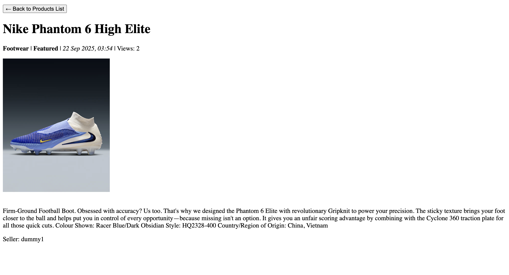

<H1>TUGAS INDIVIDU 2</H1>

<H2>1. Jelaskan bagaimana cara kamu mengimplementasikan checklist di atas secara step-by-step (bukan hanya sekadar mengikuti tutorial).</H2>

Pertama-tama, saya membuat repository baru pada github saya dan melakukan cloning repository. Lalu, saya membuat python environment baru dan menginstall beberapa dependencies yang dibutuhkan dengan menuliskannya pada berkas requirements.txt terlebih dahulu. Isi dari berkas tersebut sementara diisikan kebutuhan dasar pengembangan sesuai dengan yang telah disediakan pada tutorial. Hal ini tidak menutup kemungkinan untuk menginstall dependencies lainnya apabila dibutuhkan. Jika itu terjadi, saya bisa menjalankan command pip/pip3 install pada terminal saya dan melakukan freeze ke berkas requirements.txt untuk mengupdate list dari dependencies yang dibutuhkan.

Setelah menginstall dependencies, sekarang saya sudah bisa menjalankan command Django. Saya kemudian mengisiasikan sebuah project Django baru pada direktori repository saya dengan nama the_kickoff_zone yang direncanakan menjadi nama dari football shop saya. Setelah itu, saya melanjutkan dengan preparasi deployment ke PWS. Hal ini dilakukan dengan menambahkan environment variables pada berkas .env dan .env.prod dan melakukan konfigurasi pada settings.py dengan fungsi load_dotevnt(). Saya pun tidak lupa untuk menambahkan berkas .gitignore agar repository saya tidak melacak berkas-berkas sensitif seperti environment variables. Saya melanjutkan dengan memasukkan environment variables ke dalam PWS, menambahkan repository PWS sebagai remote repository dan melakukan deployment pada PWS sembari mengecek apakah instalasi dan inisiasi project berhasil. Tidak lupa, saya menambahkan url local dan online dari project ke dalam ALLOWED_HOST untuk membuka restriksi akses terhadap project, melakukan konfigurasi variabel PRODUCTION dan DEBUG, serta melakukan konfigurasi Database.

Setelah melakukan makemigrations dan migrate, project berhasil dideploy ke internet. Sekarang, saya melanjutkan pengembangan dengan menginisiasikan aplikasi baru dengan nama main. Kemudian, saya membuat model data baru di berkas models.py di aplikasi main dengan nama Product yang memiliki 6 atribut wajib yang dibutuhkan. Tentu model hal ini masih bisa berubah kedepannya. Apabila di lain waktu saya ingin memodifikasi model Product atau menambahkan model lainnya, saya bisa dengan mudah melakukannya dengan memodifikasi berkas models.py dan melakukan makemigrations dan migrate. 

Saya melanjutkan pengembangan dengan membuat fungsi show_main() untuk menampilkan template aplikasi main tersebut di berkas views.py dan memasukkan beberapa context untuk kemudian ditampilkan oleh template. Dengan adanya fungsi show_main(), saya bisa melakukan routing. Saya melakukan routing dengan membuat berkas urls.py di direktori aplikasi main dan mengimport fungsi show_main() dari views.py. Selanjutnya saya pasangkan fungsi show_main() tersebut dengan url pattern dengan path '' (empty string) sehingga fungsi tersebut akan dapat ditampilkan sebagai landing page tanpa memerlukan endpoint tertentu. Agar dapat berfungsi dengan benar, saya mengimport semua url dari aplikasi main ke project Django saya dengan memanfaatkan fungsi include pada berkas urls.py milik project Django saya. 

Dengan adanya model, view, dan routing, saya hanya perlu membuat template agar dapat menampilkan view kepada pengguna. Saya melanjutkan dengan membuat folder templates di direktori aplikasi main dan membuat berkas main.html. Berkas template tersebut saya isi dengan tampilan sederhana menggunakan tag header dan paragraph untuk menampilkan data yang telah diproses oleh view. Dengan demikian, selesai sudah pengembangan yang perlu dilakukan untuk tugas individu 2 ini. 

Saya juga menambahkan beberapa test dasar pada aplikasi main saya sebagai bentuk kedisiplinan saya sebagai pengembang. Kelak di tugas-tugas selanjutnya, project Django saya bisa jadi akan sangat besar sehingga menjadikan pengetesan secara manual menjadi ineffective dan time-consuming. Namun demikian, untuk sementara, test yang saya masukkan masih sangat sederhana. Tentunya hal ini akan terus berubah seiring berjalannya waktu.

Terakhir, saya melakukan git add, commit, dan push ke kedua remote repository saya (origin dan PWS). PWS kemudian akan menge-build project saya dan, voila, project saya berhasil dideploy ke internet


<H2>2. Buatlah bagan yang berisi request client ke web aplikasi berbasis Django beserta responnya dan jelaskan pada bagan tersebut kaitan antara urls.py, views.py, models.py, dan berkas html.</H2>


Referensi: Slides perkuliahan PBP Semester Gasal 2025/2026


<H2>3. Jelaskan peran settings.py dalam proyek Django!</H2>

Sesuai dengan namanya, berkas settings.py merupakan pusat konfigurasi utama untuk proyek Django yang kita miliki. Kita dapat menyeting project Django kita melalui berkas ini. Konfigurasi yang terdapat di berkas settings.py diantaranya adalah: INSTALLED_APPS, MIDDLEWARE, ALLOWED_HOSTS, Database, dan lain-lain. Berkas tersebut memastikan bahwa project Django kita berjalan dengan baik dan benar. 

Referensi: https://docs.djangoproject.com/en/5.2/topics/settings/


<H2>4. Bagaimana cara kerja migrasi database di Django?</H2>

Migrasi database di Django dilakukan dalam 2 tahap, yaitu: makemigrations dan migrate. 

Command makemigrations akan membandingkan kondisi model saat ini (setelah perubahan) dengan kondisi terakhir yang tercatat dalam file migrasi sebelumnya. Kemudian, Django akan secara otomatis membuat file python baru di dalam direktori migrations/ berdasarkan perbedaan tersebut. File yang dibuat sendiri berisikan isntruksi spesifik tentang cara menerapkan perubahan tersebut ke database. Hal ini meliputi, tetapi tidak terbatas pada: AddField, CreateTable, dan lain-lain. Secara singkat makemigrations berfungsi untuk mempersiapkan migrasi skema model ke dalam database Django lokal.

Selanjutnya command migrate akan menerjemahkan berkas-berkas migrasi yang telah dibuat sebelumnya (untuk migrasi-migrasi yang belum terimplementasi) menjadi syntax SQL atau bahasa lainnya sesuai dengan tipe database yang digunakan. Singkatnya, command ini dijalankan untuk menerapkan skema model yang telah dibuat ke dalam database Django lokal.


<H2>5. Menurut Anda, dari semua framework yang ada, mengapa framework Django dijadikan permulaan pembelajaran pengembangan perangkat lunak?</H2>

Sebelumnya, mahasiswa di Fasilkom UI sudah mengenal bahasa pemrograman Python pada masa mengambil mata kuliah Dasar-dasar Pemrograman 1. Hal ini menjadikan Django yang menggunakan bahasa pemrograman Python menjadi pilihan yang ideal untuk dijadikan permulaan pembelajaran pengembangan perangkat lunak. Selain dari itu, struktur dari aplikasi Django bersifat modular dan cenderung mudah dipahami (walaupun opini ini tentu relatif). Modularitas tersebut juga memungkinkan project-project Django bersifat lebih scalable sehingga nyaman untuk digunakan. Bahkan, aplikasi-aplikasi besar seperti Instagram, Spotify, dan Pinterest juga ternyata menggunakan Django. Hal ini membuktikan bahwa Django adalah framework yang cukup powerful. Bekal ini tentunya akan sangat berguna di dunia pekerjaan. Demikian pendapat saya.


<H2>6. Apakah ada feedback untuk asisten dosen tutorial 1 yang telah kamu kerjakan sebelumnya?</H2>

Sangat baik, Kak! Tutorial yang diberikan komprehensif dan mudah dipahami. Selain dari praktik, tutorial juga memberikan bacaan teori yang bisa kami (mahasiswa) manfaatkan untuk meningkatkan pemahaman terkait PBP. Terima kasih atas kerja kerasnya! Saya do'akan kakak-kakak senantiasa sehat dan bahagia.

<br>
<H1>TUGAS INDIVIDU 3</H1>

<H2>1. Jelaskan mengapa kita memerlukan data delivery dalam pengimplementasian sebuah platform?</H2>

Data delivery dibutuhkan oleh sebuah platform untuk menampilkan data dari backend ke frontend. Tentunya, data merupakan salah satu unsur yang sangat penting bagi sebuah platform sebagai sebuah teknologi informasi. Mengimplementasikan mekanisme data delivery yang baik bisa dilihat seperti membangun sebuah sistem peredaran darah bagi platform. Sistem inilah yang memastikan bahwa  yang tepat sampai ke tempat yang tepat pada waktu yang tepat sehingga seluruh ekosistem digital platform berfungsi sebagai satu kesatuan yang koheren. Dengan mekasnisme data delivery yang baik, kita juga mampu memisahkan cara data dikirim dan cara data diproses sehingga kita, sebagai pengembang, dapat mengembangkan dan menskalakan frontend dan backend secara independen.

<H2>2. Menurutmu, mana yang lebih baik antara XML dan JSON? Mengapa JSON lebih populer dibandingkan XML?</H2>

Saya setuju bahwasanya JSON cenderung lebih populer dibandingkan XML. Pun saya lebih senang menggunakan format JSON ketimbang XML. Alasannya bermacam-macam, mulai dari penggunaan metode key-value (JSON) yang terasa lebih intuitif dibandingkan dengan opening-closing-tag (XML), kompatibilitas parsing (dimana JSON dapat di parse secara native dengan JSON.parse()), dan dukungan JSON untuk menggunakan beberapa tipe data dasar. Kelebihan-kelebihan tersebut membuat JSON lebih populer untuk digunakan. Kendati demikian, pada kasus-kasus tertentu, format XML mungkin akan lebih cocok untuk digunakan daripada JSON. Jadi, sejatinya, tidak ada yang lebih baik diantara keduanya. Format-format tersebut baik digunakan pada kasus yang sesuai masing-masing.

Sumber: Crockford, D. (2006). The JSON Data Interchange Format. RFC 4627, W3C. (2008). Extensible Markup Language (XML) 1.0 (Fifth Edition).

<H2>3. Jelaskan fungsi dari method is_valid() pada form Django dan mengapa kita membutuhkan method tersebut!</H2>

Fungsi is_valid() menjalankan validasi data yang dikirimkan oleh pengguna terhadap aturan-aturan yang telah didefinisikan dalam kelas form yang di refer. Beberapa validasi yang dilakukan adalah: Pemeriksaan kesesuaian tipe data antara input user dan field pada form, pemeriksaan batasan (seperti: required, max_length, dll.), dan menjalankan method-method validasi custom bila ada. 

Kita membutuhkan method tersebut untuk menjaga keamanan dan integritas data karena data pada form akan diteruskan ke database yang kita miliki. Dengan mengimplementasikan fungsi is_valid() kita  memastikan semua data yang dikirim form sudah disanitasi dan bersih. Kita jadi juga bisa mengakses data bersih tersebut melalui dictionary cleaned_data yang digenerate otomatis oleh Django. 

<H2>4. Mengapa kita membutuhkan csrf_token saat membuat form di Django? Apa yang dapat terjadi jika kita tidak menambahkan csrf_token pada form Django? Bagaimana hal tersebut dapat dimanfaatkan oleh penyerang?</H2>

Cross-Site Request Forgery (CSRF) merupakan serangan siber yang terjadi ketika situs web jahat menipu pengguna yang sedang login di situs web lain untuk tanpa sadar mengirimkan request berbahaya ke situs jahat tersebut.

Salah satu manipulasi tersebut dapat adalah sebagai berikut:


Form tersebut mungkin tersedia di sebuah-situs-jahat.com, dimana situs tersebut memiliki tampilan yang identik dengan bank-aman.com sehingga user mengira bahwa ia sedang berada di bank-aman.com. Selanjutnya, boleh jadi bahwa user masih login di bank-aman.com sehingga browser akan secara otomatis menyertakan cookie sesi user dalam request tersebut. Ketika server bank-aman.com melihat permintaan POST yang valid beserta cookie yang valid, server akan mengasumsikan request tersebut valid dan berasal dari user (bukan penyerang) dan memproses transfer uang dan akhirnya user akan kehilangan uang.

Untuk mengatasi serangan tersebut, Django menggunakan , yaitu template tag yang wajib disertakan dalam setiap form di Django yang menggunakan metode POST. Token ini adalah mekanisme pertahanan utama Django melawan serangan siber yang disebut Cross-Site Request Forgery (CSRF). Saat Django me-render halaman yang berisi form dengan , ia menghasilkan sebuah token rahasia yang unik untuk sesi pengguna tersebut dan menyisipkannya sebagai input tersembunyi (hidden input) di dalam form. Ketika form tersebut di-submit, browser akan mengirimkan kembali csrfmiddlewaretoken ini bersama data form lainnya. Middleware CSRF di sisi server Django akan memeriksa apakah nilai token yang dikirim ini cocok dengan token yang seharusnya dimiliki oleh sesi pengguna tersebut. Jika csrf_token tidak ada atau tidak cocok, Django akan menolak permintaan tersebut dengan error 403 Forbidden, sehingga transaksi berbahaya seperti transfer uang di atas akan gagal. Dengan demikian, kita terhindar dari transaksi-transaksi yang berbahaya dan merugikan sebab kita memiliki mekanisme untuk validasi menggunakan csrf_token.

Sumber: 
- https://docs.djangoproject.com/en/stable/howto/csrf/
- https://cheatsheetseries.owasp.org/cheatsheets/Cross-Site_Request_Forgery_Prevention_Cheat_Sheet.html

<H2>5. Jelaskan bagaimana cara kamu mengimplementasikan checklist di atas secara step-by-step (bukan hanya sekadar mengikuti tutorial).</H2>

Tugas 3 ini masih terbilang cukup singkat. 
- Saya memulai dengan mengimplementasikan template base.html dan menambahkan path nya ke settings.py
- Kemudian, saya memodifikasi file main.html untuk mengimplementasikan template base.html tersebut.
- Karena model Product saya belum memiliki atribut id, saya melanjutkan dengan memodifikasi model saya agar memiliki kolom UUID yang digenerate secara otomatis secara default, melakukan makemigrations, dan migrate. 
- Sealnjutnya, saya membuat fungsi-fungsi baru pada views.py (create_product, show_product, show_xml, show_json, show_xml_by_id, show_json_by_id) dan melakukan routing pada urls.py di aplikasi main. 
- Saat mendefinisikan fungsi-fungsi pada views.py, saya mereturn renderan beberapa template html yang belum saya buat sehingga saya melanjutkan development dengan membuat template create_product.html dan product_details.html
- create_product.html berisi sebuah form yang akan melakukan request POST dan menambahkan produk ke database. Untuk itu, saya membuat berkas forms.py dan menambahkan domain web saya ke CSRF_TRUSTED_ORIGINS di settings.py
- product_details.html berisi representasi visual dari data Product dan detailsnya 
- Dengan terimplementasinya fitur untuk menambahkan dan menunjukkan produk, saya sudah bisa mengetes method-method GET yang telah didefinisikan sebelumnya pada views.py
- Saya melakukan testing manual secara langsung melalui browser dan juga melalui Postman. Sebelumnya, saya sudah menambahkan 2 Product ke dalam databse saya.
- Ternyata, program saya berjalan dengan baik.
- Besoknya, saya iseng untuk mengetes kembali program, tetapi terdapat error (sepertinya pada sisi database).
- Sesuai arahan asisten dosen, saya mereset schema, menghapus semua file migrations, melakukan makemigrations, dan migrate ulang pada terminal PWS.
- Sesuai arahan asisten dosen juag, saya juga melakukan hal yang sama seperti yang diatas pada project Django saya di terminal vscode. Tetapi, saya tidak perlu (bahkan, tidak bisa) mereset schema pada project local saya. Ternyata, tidak ada perubahan yang bisa diapply pada saat migrate. Saya harap ini tidak menyebabkan masalah kedepannya.
- Program kembali berjalan secara normal.

<H2>6. Apakah ada feedback untuk asdos di tutorial 2 yang sudah kalian kerjakan?</H2>

Saya rasa cukup. Terima kasih kakak-kakak asdos. Semoga senantiasa sehat dan bahagia.

<H2>7. Mengakses keempat URL di poin 2 menggunakan Postman, membuat screenshot dari hasil akses URL pada Postman, dan menambahkannya ke dalam README.md</H2>

<H3>Postman GET /xml</H3>


<H3>Postman GET /json</H3>


<H3>Postman GET /xml/str:product_id<H3>


<H3>Postman GET /json/str:product_id</H3>


<br>
<H2>TUGAS INDIVIDU 4</H2>

<H2>1. Apa itu Django AuthenticationForm? Jelaskan juga kelebihan dan kekurangannya.</H2>

Django AuthenticationForm adalah salah satu kelas bawaan dari Django yang digunakan untuk membuat formulir login. Formulir ini dirancang untuk memvalidasi kredensial pengguna, seperti username dan password, dengan membandingkannya dengan data yang ada di database.

Beberapa kelebihan Django AuthenticationForm:
- (+) Mudah diiplementasi untuk proyek Django sebab Django AuthenticationForm disediakan dan teringtegrasi secara langsung dengan Django,
- (+) Django AuthenticationForm juga memiliki fitur keamanan bawaan, yakni validasi dan penanganan hash password,
- (+) Dapat diintegrasikan secara seamless dengan sistem autentikasi dan otorisasi Django, seperti user model dan user authentication backend, dan
- (+) Penurunan risiko keamaanan sebab Django AuthenticationForm menangani Cross-Site Request Forgery (CSRF) secara otomatis.

Sedangkan, beberapa kekurangan dari Django AuthenticationForm adalah:
- (-) Butuh pekerjaan tambahan untuk menambahkan field lainnya, sebab Django AuthenticationForm hanya didesin untuk username dan password
- (-) Bukan kelemahan yang signifikan, tetapi tampilan default Django AuthenticationForm sangat sederhana dan kurang enak untuk dilihat. Untuk itu, perlu pekerjaan tambahan dalam mebuat desain user interface yang lebih sesuai.

<H2>2. Apa perbedaan antara autentikasi dan otorisasi? Bagaiamana Django mengimplementasikan kedua konsep tersebut?</H2>

Autentikasi merupakan proses memverifikasi identitas pengguna, sedangkan Otorisasi merupakan proses penentuan hak atau izin apa yang dimiliki oleh pengguna yang sudah terautentikasi. Pada umumnya, setiap user memiliki hak akses tertentu yang sudah ditentukan oleh super user ataupun admin sebagai pengelola proyek. Namun, Django hanya akan memberikan hak akses tersebut kepada user yang telah terautentikasi. Artinya, seorang pengguna haruslah menginput username dan password yang benar untuk mendapatkan hak-hak akses yang telah dialokasikan kepadanya. Ini ibarat ketika seorang mahasiswa UI mencoba untuk connect ke wifi UI dimana kita diharuskan untuk memasukkan credentials sso yang benar agar lolos autentikasi dan mendapatkan hak akses (koneksi ke jaringan internet).

Django mengimplementasikan mekanisme ini sebagai berikut
- django.contrib.auth (.models, .forms, .decorators) — Library ini menyediakan model User yang, pada proyek Django ini, telah diimport dan diimplementasikan pada model Product di models.py sehingga kita tidak perliu mendefinisikan model User secara manual. Kita bisa menambahkan UserCreationForm agar pengguna dapat membuat user secara langsung melalui interface aplikasi web. Sebagai metode autentikasi, kita juga bisa menggunakan AuthenticationForm yang telah disediakan oleh Django. Saat kita mengirimkan request melalui AuthenticationForm, Django akan memanggil fungsi authenticate() untuk memverifikasi credential yang dikirimkan oleh user. Apabila terverifikasi, user akan diautentikasi dan diotorisasikan hak-hak akses tertentu. Sebuah fungsi login diimplementasikan untuk membuat sesi bagi pengguna yang kemudian disimpan dalam sebuah cookie. Selain itu, fungsi login dipasangkan dengan fungsi logout pula agar user dapat menghapus sesi dan menghilangkan status "sudah masuk." Jika user berhasil login, maka atribut is_authenticated pada instance user tersebut akan diubah menjadi True dan diubah kembali menjadi False saat user melakukan logout. Atribut tersebut digunakan oleh Django untuk membedakan user yang terautentikasi dan tidak, misalnya dengan menggunakan decorator @login_required, kita bisa memastikan bahwa hanya user yang telah login lah yang bisa menakses halaman tersebut.


<H2>3. Apa saja kelebihan dan kekurangan session dan cookies dalam konteks menyimpan state di aplikasi web?</H2>

Session adalah cara untuk menyimpan data pengguna di sisi server, dengan Session ID yang disimpan di cookie pengguna. 

Kelebihan session:
- Data tidak disimpan di client-side sehingga lebih aman (Terhindar dari data theft, data tampering, dan cross-site scripting atau XSS).
- Tidak ada batasan kapasitas data yang ketat. Hal ini tergantung pada kapasitas server.

Kekurangan session:
- Karena data disimpan di server maka server harus mengalokasikan memori untuk menyimpan data tersebut
- Sulit untuk diimplementasikan dalam skala besar (multi-server) kecuali menggunakan server session terpusat

Sedangkan, cookies adalah cara untuk menyimpan data pengguna langsung di sisi client (browser).

Kelebihan cookies:
- Berbeda dengan session, data cookies disimpan di client-side sehingga beban server lebih ringan
- Cookies juga unggul dalam hal fleksibilitas sebab mudah digunakan untuk menyimpan preferensi pengguna atau data kecil

Kekurangan cookies:
- Data dapat dilihat dan dimanipulasi oleh pengguna, rentan terhadap Cross-Site Scripting (XSS)
- Ukuran data yang dapat disimpan sangat kecil dan terbatas (sekitar 4KB)

<H2>4. Apakah penggunaan cookies aman secara default dalam pengembangan web, atau apakah ada risiko potensial yang harus diwaspadai? Bagaimana Django menangani hal tersebut?</H2>

Secara default, penggunaan cookies dalam pengembangan web bukanlah solusi yang aman. Beberapa risiko keamanan yang patut kita waspadai adalah sebagai berikut:
- Session hijacking, yaitu serangan dimana penyerang mencuri Session ID dari cookie untuk mengambil alih sesi pengguna.
- Pengunaan cookies juga rentant terhadap penyalahgunaan data sebab data disimpan di client-side. Data tersebut dapat dimanipulasi oleh penyerang dan mengakibatkan kerusakan atau perubahan data yang tidak diinginkan.

Django menangai risiko-risiko keamanan tersebut dengan:
- Penggunaan Signed Cookies: Django secara default menggunakan cookies yang ditandatangani secara kriptografis sehingga mampu mencegah cookies dimodifikasi di sisi klien. Jika ada perubahan pada cookies, Django akan menolaknya.
- Django juga hanya akan menyimpan Session ID di cookie pengguna, sedangkan data sesi yang sebenarnya disimpan di sisi server sehingga data tetap terproteksi yang membuat data lebih aman. Session ID tersebut dapat diibaratkan sebagai kunci untuk membuka loker (data sebenarnya yang disimpan di server).
- Selain itu, Django menyediakan opsi untuk mengatur secure cookie yang memastikan bahwa cookie hanya dikirim melalui koneksi HTTPS yang terenkripsi.
- Secara default, Django juga mengaktifkan pengaturan HttpOnly pada cookies sehingga mampu mencegah JavaScript di sisi klien untuk mengakses cookie tersebut dan memitigasi risiko serangan XSS.

<H2>5. Jelaskan bagaimana cara kamu mengimplementasikan checklist di atas secara step-by-step (bukan hanya sekadar mengikuti tutorial).</H2>

- Pertama-tama, saya menyiapkan fungsi regsiter() dan login_user() pada views.py. Fungsi ini ditujukan untuk membuat instance user baru (register) dan menghandle autentikasi user tersebut (login_user). 
- Kemudian, saya menyadari bahwa kita perlu membuat atribut user pada model Products saya sehingga saya melanjutkan pengembangan dengan memodifikasi model tersebut dan melakukan makemigrations, serta migrate.
- Untuk melengkapi fungsi register() dan login_user(), saya membuat 2 berkas html baru pada direktori templates di aplikasi main, yaitu register.html dan login.html. Sekarang, fungsi register() dan login_user() sudah dapat digunakan.
- Agar template-template tersebut dapat ditampilkan, saya melanjutkan dengan mengonfigurasi routing pada berkas urls.py.
- Saya pun sadar bahwa saya belum mengimplementasikan fungsi logout. Saya melanjutkan pengembangan dengan mendefinisikan fungsi logout_user() pada views.py dan menambahkan button dan menautkannya dengan hyperlink menuju fungsi logout_user() yang telah saya konfigurasikan pula pada berkas urls.py.
- Saya melengkapi program dengan menambahkan dekorator @login_required pada fungsi show_main() dan show_product() agar halaman-halaman aplikasi saya dibatasi untuk ditampilkan pada user-user yang sudah berhasil login saja.
- Selanjutnya, saya menambahkan pemanfaatan data dari cookies dengan menambahkan cookie 'last_login' untuk dikembalikan oleh fungsi show_main() dan dihapus saat user menjalankan logout_user(). 
- Untuk menampilkan last_login, saya menambahkan sebuah header tag pada tempalte main.html, template yang berkorespondensi dengan dan dirender oleh show_main()
- Saya melengkapi fungsi create_product untuk mengisi atribut user dan menambahkan fitur filter pada template main.html, serta menampilkan nama penjual pada template product_details.html.
- Terakhir, saya mengimplementasikan functinal test dengan Selenium dan memastikan bahwa aplikasi saya lolos uji beberapa tes dasar.

<H2>Lampiran: Dua akun pengguna dengan masing-masing 3 dummy data di lokal</H2>

<H3>Akun pengguna 1: dummy1</H3>
 





<H3>Akun pengguna 2: dummy2</H3>


<br>
<H1>TUGAS INDIVIDU 5</H1>

<H2>1. Jika terdapat beberapa CSS selector untuk suatu elemen HTML, jelaskan urutan prioritas pengambilan CSS selector tersebut!</H2>

Ketika beberapa selector CSS menargetkan elemen HTML yang sama, browser akan menentukan aturan mana yang akan diterapkan berdasarkan urutan prioritas yang dikenal sebagai spesifisitas (specificity) dan kaidah turunan (cascade). Aturan dengan spesifisitas lebih tinggi akan diutamakan.

Urutan prioritas dari yang tertinggi hingga terendah adalah sebagai berikut:
- Inline Styles: Atribut style yang ditulis langsung pada tag HTML. Ini memiliki prioritas mutlak. 

Contoh: ```<p style="color: red;">Teks ini pasti merah.</p>```

Output: <p style="color: red;">Teks ini pasti merah.</p>

- ID Selectors: Selector yang menggunakan #id. ID harus unik dalam satu halaman.

Contoh: ```#header { background-color: blue; }```

- Class, Attribute, dan Pseudo-class Selectors: Ketiganya memiliki tingkat spesifisitas yang sama.

- - Class: Selector yang diawali dengan titik (.). 

Contoh: ```.tombol-utama { border: none; }```

- - Attribute: Selector yang menargetkan elemen berdasarkan atributnya.

Contoh: ```input[type="text"] { width: 100%; }```

- - Pseudo-class: Selector untuk state khusus elemen.

Contoh: ```a:hover { text-decoration: underline; }```

- Type Selectors dan Pseudo-elements:

- - Type: Selector yang menargetkan nama tag HTML. 

Contoh: ```p { font-size: 16px; }```

- - Pseudo-element: Selector yang menargetkan bagian spesifik dari elemen.

Contoh: ```p::first-line { font-weight: bold; }```

Jika dua selector memiliki nilai spesifisitas yang sama, maka aturan yang didefinisikan paling akhir di dalam berkas CSS akan menjadi pemenangnya. Penggunaan !important akan mengesampingkan semua aturan di atas, namun praktiknya sangat tidak dianjurkan karena dapat merusak alur cascade dan menyulitkan proses debugging.

<H2>2. Mengapa responsive design menjadi konsep yang penting dalam pengembangan aplikasi web? Berikan contoh aplikasi yang sudah dan belum menerapkan responsive design, serta jelaskan mengapa!</H2>

Responsive design adalah sebuah pendekatan dalam pengembangan web yang memastikan tampilan situs dapat beradaptasi secara optimal dengan berbagai ukuran layar perangkat, mulai dari monitor desktop yang lebar hingga layar ponsel yang kecil. Konsep ini menjadi sangat penting karena beberapa alasan krusial:

- Dominasi Pengguna Mobile

Saat ini, mayoritas akses internet dilakukan melalui perangkat seluler. Tanpa desain yang responsif, pengguna mobile akan mendapatkan pengalaman yang buruk, seperti harus melakukan zoom dan scroll horizontal.

- Peningkatan User Experience (UX)

Situs yang responsif memberikan pengalaman pengguna yang lebih baik dan intuitif, yang pada akhirnya dapat meningkatkan kepuasan dan retensi pengguna.

- Optimasi Mesin Pencari (SEO)

Mesin pencari seperti Google secara eksplisit memprioritaskan situs yang mobile-friendly dalam peringkat pencariannya. Situs yang tidak responsif berisiko kehilangan visibilitas secara signifikan.

- Efisiensi Pengembangan

Daripada membangun dan memelihara beberapa versi situs (satu untuk desktop, satu untuk mobile), responsive design memungkinkan pengembang untuk bekerja dengan satu basis kode yang sama.

Contoh Aplikasi:

- Sudah Menerapkan (Baik): Tokopedia,

Situs Tokopedia secara cerdas menyesuaikan tata letaknya. Pada desktop, halaman menampilkan banyak produk dalam format grid multi-kolom untuk memaksimalkan ruang. Saat dibuka di ponsel, tata letaknya berubah menjadi satu atau dua kolom vertikal, sehingga lebih mudah di-scroll dengan ibu jari.

- Belum Menerapkan (Contoh Klasik):

Banyak situs web institusi atau pemerintahan versi lama yang tidak responsif. Contohnya adalah situs-situs arsip akademis lama. Jika dibuka di ponsel, seluruh halaman versi desktop hanya diperkecil, membuat teks menjadi sangat kecil dan tautan sulit untuk diklik tanpa melakukan zoom manual. Hal ini terjadi karena situs tersebut dibangun dengan dimensi yang tetap (fixed-width) dan tidak menggunakan media queries untuk beradaptasi.

<H2>3. Jelaskan perbedaan antara margin, border, dan padding, serta cara untuk mengimplementasikan ketiga hal tersebut!</H2>

Margin, border, dan padding adalah tiga komponen inti dari CSS Box Model, yang mendefinisikan ruang di sekitar setiap elemen HTML.

- Padding (Bantalan Dalam)

Padding merupakan ruang transparan yang berada di dalam border. Fungsinya adalah untuk memberikan jarak antara konten (misalnya teks atau gambar) dengan border elemen itu sendiri.

- Border (Garis Batas)

Border merupakan garis yang mengelilingi padding dan konten. Kita bisa mengatur ketebalan, gaya (misalnya solid, dashed), dan warnanya.

- Margin (Jarak Luar)

Margin merupakan ruang transparan yang berada di luar border. Fungsinya adalah untuk menciptakan jarak antara elemen tersebut dengan elemen lain di sekitarnya.

Ketiga properti ini dapat diimplementasikan dalam CSS dengan cara berikut:

```
.elemen-kotak {
/* Padding: 10 piksel di semua sisi */
padding: 10px;

/* Border: 2 piksel, garis lurus, warna hitam */
border: 2px solid black;

/* Margin: 20 piksel di semua sisi */
margin: 20px;
}
```

Kita juga bisa mengatur setiap sisi secara individual, misalnya padding-top, margin-left, atau border-bottom-color untuk kontrol yang lebih presisi.

<H2>4. Jelaskan konsep flex box dan grid layout beserta kegunaannya!</H2>

Flexbox dan Grid adalah dua model tata letak modern di CSS yang dirancang untuk menyusun elemen secara efisien dan responsif. Keduanya memiliki tujuan yang berbeda.

- Flexbox (Flexible Box Layout)

- - Konsep

Flexbox adalah model tata letak satu dimensi. Artinya, ia sangat baik dalam mengatur elemen dalam satu baris (horizontal) atau satu kolom (vertikal), tetapi tidak keduanya secara bersamaan. Bayangkan menata buku di satu rak; bisa berjajar ke samping atau menumpuk ke atas.

- - Kegunaan Utama

- - - Penyelarasan Komponen

Sangat ideal untuk menyelaraskan item di dalam sebuah komponen, seperti menengahkan tombol di dalam sebuah kartu (card), atau menyebarkan item navigasi secara merata.

- - - Tata Letak Dinamis

Ketika jumlah atau ukuran item tidak diketahui, Flexbox dapat secara fleksibel "membungkus" (wrap) item ke baris berikutnya.

- - - Distribusi Ruang

Mudah untuk mendistribusikan ruang kosong di antara item-item.

- Grid Layout

- - Konsep

Grid adalah model tata letak dua dimensi. Ia memungkinkan kita untuk mengatur elemen dalam baris dan kolom secara bersamaan, layaknya sebuah tabel atau spreadsheet. Ini memberikan kontrol penuh atas posisi elemen di kedua sumbu.

- - Kegunaan Utama

Tata Letak Halaman Utama: Sempurna untuk merancang struktur utama sebuah halaman web, seperti mendefinisikan area untuk header, sidebar, konten utama, dan footer.

- - - Desain Kompleks

Ketika dibutuhkan tata letak yang presisi dan tumpang tindih, Grid adalah pilihan yang tepat.

- - - Galeri

Membuat galeri gambar atau produk yang tersusun rapi dalam baris dan kolom yang konsisten.

Secara sederhana, gunakan Flexbox untuk mengatur konten di dalam sebuah komponen, dan gunakan Grid untuk mengatur tata letak komponen-komponen tersebut di halaman.

<H2>5. Jelaskan bagaimana cara kamu mengimplementasikan checklist di atas secara step-by-step (bukan hanya sekadar mengikuti tutorial)!</H2>

1. Pertama-tama saya memodifikasi base.html dan menambahkan script serta link untuk menghubungkan dengan tailwindcss dan stylings
2. Lalu, saya membuat direktori static pada root dan membuat direktori css
3. Di direktori css, saya membuat sebuah berkas global.css yang berfungsi untuk mendefinisikan style-style global pada projek
4. Tidak lupa, saya menambahkan static url di berkas settings.py 
5. Saya melakukan styling dasar dan memulai dengan membuat berkas navbar.html pada /templates/partial/
6. Saya juga membuat footer agar website terlihat lebih professional
7. Ketika saya mencoba untuk add, commit, dan push ke pws, ternyata stylingnya tidak ada atau belum ter-apply
8. Setelah meriset isu tersebut, ternyata saya perlu menambahkan WhiteNoiseMiddleware pada settings.py dan segera menambahkannya
9. Sekarang styling sudah ada dan berjalan dengan baik
10. Saya melanjutkan dengan memodifikasi navbar agar responsif dan menambahkan icon hamburger untuk mendukung kompatibilitas navbar pada layar yang lebih kecil seperti pada mobile devices
11. Pada templates di direktori main, saya juga membuat direktori partials dan membuat product_card.html
12. Saya memodifikasi main untuk menampilkan product-product menggunakan product_card.html tersebut
13. Saya juga membuat hero section pada main.html saya agar website terlihat lebih menarik
14. Saya melanjutkan pengembangan dengan memodifikasi styling pada forms, seperti pada register, login, create_product, dan edit_product
15. Terakhir, saya menambahkan styling pada product_details
16. Development styling dasar selesai dan siap untuk dikembangkan secara lebih lanjut di masa mendatang

<br>
<H1>TUGAS INDIVIDU 6</H1>

### 1\. Apa Perbedaan Antara Synchronous dan Asynchronous Request?

Perbedaan mendasar antara _synchronous_ (sinkron) dan _asynchronous_ (asinkron) terletak pada cara mereka menangani alur kerja saat meminta data dari server.

*   **Synchronous Request (Permintaan Sinkron)**
    
    *   **Cara Kerja:** Ketika peramban mengirim permintaan sinkron, ia akan **menghentikan semua proses lain** dan menunggu hingga server memberikan respons. Selama menunggu, pengguna tidak bisa berinteraksi dengan halaman web (UI akan "membeku"). Halaman baru akan dimuat secara penuh setelah respons diterima.
        
    *   **Analogi:** Seperti menelepon seseorang dan Anda harus menunggu di telepon tanpa bisa melakukan hal lain sampai panggilan selesai.
        
    *   **Contoh:** Klik pada sebuah link yang membuka halaman baru atau mengirimkan form HTML tradisional yang menyebabkan seluruh halaman di-reload.
        
*   **Asynchronous Request (Permintaan Asinkron)**
    
    *   **Cara Kerja:** Ketika peramban mengirim permintaan asinkron (menggunakan AJAX), ia **tidak menghentikan proses lain**. Permintaan dikirim di latar belakang. Pengguna dapat terus berinteraksi dengan halaman web sementara peramban menunggu respons dari server. Ketika respons tiba, hanya bagian tertentu dari halaman yang diperbarui menggunakan JavaScript, tanpa perlu me-reload seluruh halaman.
        
    *   **Analogi:** Seperti mengirim pesan teks (SMS/WhatsApp). Anda bisa melanjutkan aktivitas lain setelah pesan terkirim, dan Anda akan mendapatkan notifikasi saat balasan tiba.
        
    *   **Contoh:** _Infinite scroll_ di media sosial, memberikan "like" pada sebuah postingan, atau melihat saran pencarian saat Anda mengetik di kolom pencarian.
        

### 2\. Bagaimana AJAX Bekerja di Django (Alur Request–Response)?

Alur kerja AJAX dalam aplikasi Django melibatkan komunikasi antara client-side (JavaScript di peramban) dan server-side (view Django).

1.  **Aksi Pengguna (Client-Side):** Pengguna melakukan aksi, misalnya mengklik tombol "Suka".
    
2.  **JavaScript Memicu Request:** Sebuah fungsi JavaScript yang terkait dengan aksi tersebut dieksekusi. Fungsi ini menggunakan fetch() API atau XMLHttpRequest untuk membuat permintaan HTTP (biasanya GET atau POST) ke sebuah URL spesifik di server Django. Data yang relevan (misalnya, ID postingan) dikirim bersama permintaan.
    
3.  **URL Django Menerima Request:** urls.py Django akan mencocokkan URL dari permintaan AJAX dengan view yang sesuai.
    
4.  **View Django Memproses Request:** View yang dituju akan mengeksekusi logika yang diperlukan. Ini bisa berupa mengambil data dari database, memvalidasi data, atau menyimpan informasi baru.
    
5.  **View Mengembalikan Respons JSON:** Alih-alih me-render template HTML penuh, view ini biasanya mengembalikan data dalam format JSON menggunakan JsonResponse dari Django. Ini lebih ringan dan mudah diproses oleh JavaScript.
    
6.  **JavaScript Menerima dan Memproses Respons (Client-Side):** Fungsi JavaScript di client yang tadi mengirim permintaan akan menerima JsonResponse.
    
7.  **Pembaruan DOM (Client-Side):** JavaScript kemudian menggunakan data dari respons untuk memanipulasi DOM (Document Object Model). Misalnya, mengubah ikon "Suka" menjadi berwarna, memperbarui jumlah suka, atau menampilkan pesan sukses, semuanya tanpa me-reload halaman.
    

### 3\. Apa Keuntungan Menggunakan AJAX Dibandingkan Render Biasa?

Menggunakan AJAX memberikan beberapa keuntungan signifikan dibandingkan dengan metode rendering halaman penuh tradisional:

*   **Pengalaman Pengguna (UX) yang Lebih Baik:** Interaksi terasa lebih cepat dan mulus karena tidak ada jeda untuk reload halaman penuh. Ini membuat website terasa lebih responsif dan modern, mirip seperti aplikasi desktop.
    
*   **Mengurangi Beban Server dan Bandwidth:** Karena hanya data yang diperlukan (biasanya dalam format JSON yang ringan) yang ditransfer antara client dan server, penggunaan bandwidth menjadi lebih efisien. Server juga tidak perlu me-render ulang seluruh template HTML setiap saat.
    
*   **Peningkatan Performa:** Dengan memuat dan memperbarui bagian-bagian kecil dari halaman, waktu respons yang dirasakan oleh pengguna menjadi jauh lebih cepat.
    
*   **Interaktivitas yang Lebih Tinggi:** Memungkinkan pembuatan fitur-fitur dinamis yang kompleks seperti _chat real-time_, notifikasi, _auto-complete_, dan validasi form secara langsung tanpa submit.
    

### 4\. Bagaimana Cara Memastikan Keamanan Saat Menggunakan AJAX?

Keamanan adalah aspek krusial. Meskipun AJAX berjalan di latar belakang, permintaan yang dikirim tetap merupakan permintaan HTTP biasa dan rentan terhadap serangan yang sama. Berikut cara mengamankannya di Django:

*   **Gunakan CSRF Protection Django:** Serangan _Cross-Site Request Forgery_ (CSRF) tetap menjadi ancaman. Django memiliki sistem perlindungan CSRF bawaan yang kuat. Pastikan _token_ CSRF disertakan dalam _header_ permintaan AJAX Anda. Django menyediakan potongan kode JavaScript di dokumentasinya untuk melakukan ini secara otomatis.
    
*   **Validasi di Sisi Server (Server-Side Validation):** **Jangan pernah percaya input dari client.** Semua data yang dikirim melalui AJAX harus divalidasi dan dibersihkan di view Django Anda, sama seperti yang Anda lakukan pada pengiriman form biasa.
    
*   **Gunakan HTTPS:** Selalu gunakan HTTPS (SSL/TLS) untuk mengenkripsi data yang dikirim antara client dan server, terutama untuk fitur sensitif seperti login dan register. Ini mencegah serangan _man-in-the-middle_.
    
*   **Otentikasi dan Otorisasi:** Gunakan dekorator @login\_required atau sistem _permission_ Django di view yang menangani permintaan AJAX untuk memastikan hanya pengguna yang sah yang dapat mengakses atau memodifikasi data.
    
*   **Hindari Mengekspos Informasi Sensitif:** Dalam JsonResponse, hanya kembalikan data yang benar-benar dibutuhkan oleh client. Jangan pernah mengirimkan data sensitif seperti _password hash_ atau informasi pribadi lainnya.
    

### 5\. Bagaimana AJAX Mempengaruhi Pengalaman Pengguna (User Experience)?

AJAX secara langsung merevolusi pengalaman pengguna di web dengan cara:

*   **Responsivitas Instan:** Pengguna mendapatkan umpan balik visual secara langsung atas tindakan mereka (misalnya, item ditambahkan ke keranjang belanja) tanpa gangguan reload halaman.
    
*   **Alur Kerja yang Tidak Terputus:** Pengguna dapat terus melakukan tugas mereka tanpa kehilangan konteks. Contohnya, mengisi form panjang dan mendapatkan validasi per-kolom secara _real-time_ tanpa harus mengirim form terlebih dahulu dan kehilangan data yang sudah diisi.
    
*   **Mengurangi Waktu Tunggu:** Menghilangkan reload halaman berarti mengurangi waktu yang dihabiskan pengguna untuk menatap layar putih yang sedang memuat.
    
*   **Menciptakan "App-like Feel":** Interaksi yang mulus dan dinamis membuat website modern terasa seperti aplikasi desktop atau seluler yang canggih, bukan sekadar kumpulan dokumen statis.
    

Secara keseluruhan, implementasi AJAX yang baik dapat secara dramatis meningkatkan kepuasan dan keterlibatan pengguna di sebuah situs web.